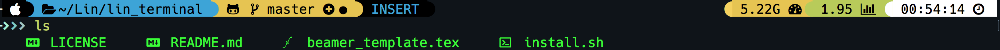

# BeautifulTerminal 

terminal is so cool!



## 相关依赖包

- [iterm2](https://www.iterm2.com/)
- [zsh](https://github.com/robbyrussell/oh-my-zsh/wiki/Installing-ZSH)
- [oh-my-zsh](https://ohmyz.sh/)
- [iterm darkside theme](https://github.com/mbadolato/iTerm2-Color-Schemes/tree/master/schemes)
- [powerlevel9k](https://github.com/romkatv/powerlevel10k)
- [tmux config](https://github.com/samoshkin/tmux-config)
- [zsh-autosuggestions](https://github.com/zsh-users/zsh-autosuggestions)
- [zsh-syntax-highlighting](https://github.com/zsh-users/zsh-syntax-highlighting)
- [colorls](https://github.com/athityakumar/colorls)
- [fzf](https://github.com/junegunn/fzf)

## 脚本安装

```shell
git clone https://github.com/QuestMi/BeautifulTerminal.git

cd BeautifulTerminal

./install.sh
```

## Lin分享
[Lin知乎](https://zhuanlan.zhihu.com/everyday-lin)

## License

MIT @ [xqlip](https://github.com/xqlip)
